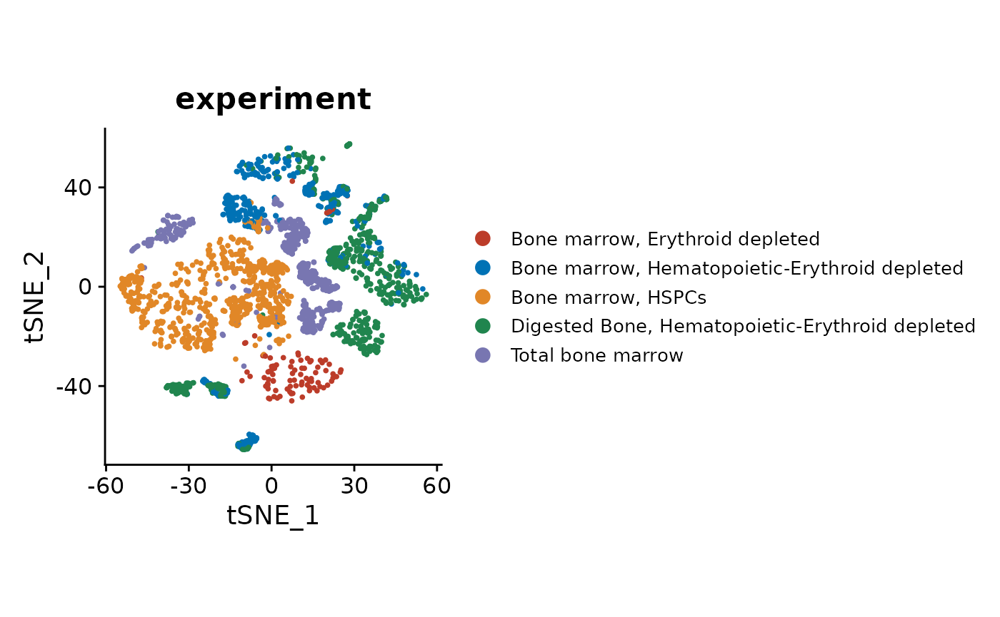
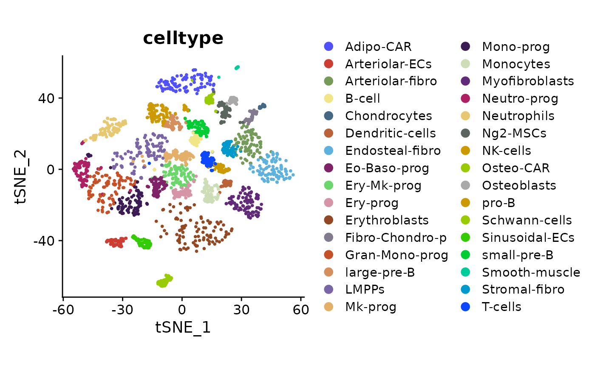

# Cell type annotation example

## Introduction

Assignment of cell type labels to scRNA-seq clusters is particularly
difficult when unexpected or poorly described populations are present.
There are fully automated algorithms for cell type annotation, but
sometimes a more in-depth analysis is helpful in understanding the
captured cells. This is an example of exploratory cell type analysis
using clustermole, starting with a Seurat object.

The dataset used in this example contains hematopoietic and stromal bone
marrow populations ([Baccin et
al.](https://doi.org/10.1038/s41556-019-0439-6)). This experiment was
selected because it includes both well-known as well as rare cell types.

## Load data

Load relevant packages.

``` r

library(Seurat)
library(dplyr)
library(ggplot2)
library(ggsci)
library(clustermole)
```

Download the dataset, which is stored as a Seurat object. It was subset
for this tutorial to reduce the size and speed up processing.

``` r

so <- readRDS(url("https://osf.io/cvnqb/download"))
so
#> An object of class Seurat 
#> 16701 features across 2821 samples within 1 assay 
#> Active assay: RNA (16701 features, 2872 variable features)
#>  2 layers present: counts, data
#>  3 dimensional reductions calculated: pca, tsne, umap
```

Check the experiment labels on a tSNE visualization, as shown in the
original publication ([original
figure](https://www.nature.com/articles/s41556-019-0439-6/figures/1)).

``` r

DimPlot(so, reduction = "tsne", group.by = "experiment", shuffle = TRUE) +
  theme(aspect.ratio = 1, legend.text = element_text(size = rel(0.7))) +
  scale_color_nejm()
```



Check the cell type labels on a tSNE visualization.

``` r

DimPlot(so, reduction = "tsne", group.by = "celltype", shuffle = TRUE) +
  theme(aspect.ratio = 1, legend.text = element_text(size = rel(0.8))) +
  scale_color_igv()
```



Set the Seurat object cell identities to the predefined cell type labels
for the next steps.

``` r

Idents(so) <- "celltype"
levels(Idents(so))
#>  [1] "Adipo-CAR"        "Arteriolar-ECs"   "Arteriolar-fibro" "B-cell"          
#>  [5] "Chondrocytes"     "Dendritic-cells"  "Endosteal-fibro"  "Eo-Baso-prog"    
#>  [9] "Ery-Mk-prog"      "Ery-prog"         "Erythroblasts"    "Fibro-Chondro-p" 
#> [13] "Gran-Mono-prog"   "large-pre-B"      "LMPPs"            "Mk-prog"         
#> [17] "Mono-prog"        "Monocytes"        "Myofibroblasts"   "Neutro-prog"     
#> [21] "Neutrophils"      "Ng2-MSCs"         "NK-cells"         "Osteo-CAR"       
#> [25] "Osteoblasts"      "pro-B"            "Schwann-cells"    "Sinusoidal-ECs"  
#> [29] "small-pre-B"      "Smooth-muscle"    "Stromal-fibro"    "T-cells"
```

## Marker gene overlaps

One type of analysis facilitated by clustermole is based on comparison
of marker genes.

We can start with the B-cells, which is a well-defined population used
in many studies.

### B-cells

Find markers for the B-cell cluster.

``` r

b_markers_df <- FindMarkers(so, ident.1 = "B-cell", min.pct = 0.2, only.pos = TRUE, verbose = FALSE)
nrow(b_markers_df)
#> [1] 1631
```

We can subset to just the best 25 markers.

``` r

b_markers <- head(rownames(b_markers_df), 25)
b_markers
#>  [1] "Ms4a1"         "Fcmr"          "Cd74"          "Ly6d"         
#>  [5] "Gm43603"       "Bank1"         "2010309G21Rik" "Fcer2a"       
#>  [9] "H2-DMb2"       "H2-Eb1"        "Cd79a"         "H2-Aa"        
#> [13] "Tnfrsf13c"     "Ltb"           "Cd79b"         "Ccr7"         
#> [17] "Fcrl1"         "Spib"          "Siglecg"       "Cd83"         
#> [21] "Fcrla"         "Srpk3"         "Cd22"          "Cxcr5"        
#> [25] "H2-Ab1"
```

Check the overlap of B-cell markers with all clustermole cell type
signatures.

``` r

overlaps_tbl <- clustermole_overlaps(genes = b_markers, species = "mm")
```

Check the top scoring cell types corresponding to the B-cell cluster
markers.

``` r

head(overlaps_tbl, 15)
#> # A tibble: 15 × 9
#>    celltype_full                                                    db        
#>    <chr>                                                            <chr>     
#>  1 follicular_B-cells | SaVanT                                      SaVanT    
#>  2 B cell (Renal Cell Carcinoma) | Kidney | Human | CellMarker      CellMarker
#>  3 DURANTE_ADULT_OLFACTORY_NEUROEPITHELIUM_B_CELLS | Human | MSigDB MSigDB    
#>  4 IMGN_B_Fo_MLN | Mouse | SaVanT                                   SaVanT    
#>  5 B cells | Immune system | Human | PanglaoDB                      PanglaoDB 
#>  6 AIZARANI_LIVER_C34_MHC_II_POS_B_CELLS | Human | MSigDB           MSigDB    
#>  7 B cells naive | Immune system | Human | PanglaoDB                PanglaoDB 
#>  8 IMGN_B_Fo_LN | Mouse | SaVanT                                    SaVanT    
#>  9 IMGN_B_FrE_BM | Mouse | SaVanT                                   SaVanT    
#> 10 IMGN_B_T3_Sp | Mouse | SaVanT                                    SaVanT    
#> 11 spleen | SaVanT                                                  SaVanT    
#> 12 B cell | Kidney | Human | CellMarker                             CellMarker
#> 13 FAN_EMBRYONIC_CTX_BRAIN_B_CELL | Human | MSigDB                  MSigDB    
#> 14 B cell | Kidney | Mouse | CellMarker                             CellMarker
#> 15 IMGN_B1a_Sp | Mouse | SaVanT                                     SaVanT    
#> # ℹ 7 more variables: species <chr>, organ <chr>, celltype <chr>,
#> #   n_genes <int>, overlap <dbl>, p_value <dbl>, fdr <dbl>
```

As would be expected for a well-defined population, the top results are
various B-cell populations. We can repeat this process for other
populations that are more obscure.

### Adipo-CAR

Find markers for the Adipo-CAR cluster. These are Cxcl12-abundant
reticular (CAR) cells expressing adipocyte-lineage genes.

``` r

acar_markers_df <- FindMarkers(so, ident.1 = "Adipo-CAR", min.pct = 0.2, only.pos = TRUE, verbose = FALSE)
acar_markers <- head(rownames(acar_markers_df), 25)
acar_markers
#>  [1] "Adipoq"        "Kng1"          "Kng2"          "Esm1"         
#>  [5] "Cxcl12"        "Lpl"           "Gdpd2"         "Agt"          
#>  [9] "Dpep1"         "Lepr"          "Fst"           "Chrdl1"       
#> [13] "Pdzrn4"        "Kitl"          "Cxcl14"        "Ccl19"        
#> [17] "Ptx3"          "Ackr4"         "1500009L16Rik" "Gas6"         
#> [21] "Serpina12"     "C4b"           "Gm4951"        "Fbln5"        
#> [25] "Wisp2"
```

Check the overlap of Adipo-CAR markers with all cell type signatures.

``` r

overlaps_tbl <- clustermole_overlaps(genes = acar_markers, species = "mm")
```

Check the top scoring cell types for the Adipo-CAR cluster.

``` r

head(overlaps_tbl, 15)
#> # A tibble: 15 × 9
#>    celltype_full                                                  db        
#>    <chr>                                                          <chr>     
#>  1 IMGN_FRC_MLN | Mouse | SaVanT                                  SaVanT    
#>  2 OMENTUM | ARCHS4                                               ARCHS4    
#>  3 HAY_BONE_MARROW_STROMAL | Human | MSigDB                       MSigDB    
#>  4 GASTRIC TISSUE (BULK) | ARCHS4                                 ARCHS4    
#>  5 Schwalie et al.Nature.G3 | Adipose tissue | Mouse | CellMarker CellMarker
#>  6 LUNG (BULK TISSUE) | ARCHS4                                    ARCHS4    
#>  7 Schwalie et al.Nature.P3 | Adipose tissue | Mouse | CellMarker CellMarker
#>  8 HBA_Adipocyte | Human | SaVanT                                 SaVanT    
#>  9 HPCA_Adipocytes | Human | SaVanT                               SaVanT    
#> 10 IMGN_FRC_SLN | Mouse | SaVanT                                  SaVanT    
#> 11 SUBCUTANEOUS ADIPOSE TISSUE | ARCHS4                           ARCHS4    
#> 12 ADIPOSE (BULK TISSUE) | ARCHS4                                 ARCHS4    
#> 13 BREAST (BULK TISSUE) | ARCHS4                                  ARCHS4    
#> 14 ASTROCYTE | ARCHS4                                             ARCHS4    
#> 15 Medullary cell | Kidney | Mouse | CellMarker                   CellMarker
#> # ℹ 7 more variables: species <chr>, organ <chr>, celltype <chr>,
#> #   n_genes <int>, overlap <dbl>, p_value <dbl>, fdr <dbl>
```

The top results are more diverse than for B-cells, but related
populations are among the top candidates.

### Osteoblasts

Find markers for the Osteoblasts cluster.

``` r

o_markers_df <- FindMarkers(so, ident.1 = "Osteoblasts", min.pct = 0.2, only.pos = TRUE, verbose = FALSE)
o_markers <- head(rownames(o_markers_df), 25)
o_markers
#>  [1] "Cpz"           "Smpd3"         "Col22a1"       "Ifitm5"       
#>  [5] "Mlip"          "Bglap"         "Lipc"          "Cgref1"       
#>  [9] "Col13a1"       "Entpd3"        "Fabp3"         "Bglap2"       
#> [13] "Cthrc1"        "Bglap3"        "Col11a2"       "Rerg"         
#> [17] "Cdo1"          "Car3"          "Slc36a2"       "RP23-457J22.1"
#> [21] "Col24a1"       "Col11a1"       "Bmp3"          "Cadm1"        
#> [25] "Satb2"
```

Check overlap of Osteoblasts markers with all cell type signatures.

``` r

overlaps_tbl <- clustermole_overlaps(genes = o_markers, species = "mm")
```

Check the top scoring cell types for the Osteoblasts cluster.

``` r

head(overlaps_tbl, 15)
#> # A tibble: 15 × 9
#>    celltype_full                                                   db        
#>    <chr>                                                           <chr>     
#>  1 DCLK1+ progenitor cell | Large intestine | Human | CellMarker   CellMarker
#>  2 GAO_LARGE_INTESTINE_24W_C1_DCLK1POS_PROGENITOR | Human | MSigDB MSigDB    
#>  3 VALVE | ARCHS4                                                  ARCHS4    
#>  4 OSTEOBLAST | ARCHS4                                             ARCHS4    
#>  5 Cartilage | Human | TISSUES                                     TISSUES   
#>  6 GASTRIC TISSUE (BULK) | ARCHS4                                  ARCHS4    
#>  7 HAY_BONE_MARROW_PLASMA_CELL | Human | MSigDB                    MSigDB    
#>  8 Chondrogenic cell | Adipose tissue | Mouse | CellMarker         CellMarker
#>  9 BREAST (BULK TISSUE) | ARCHS4                                   ARCHS4    
#> 10 LUNG (BULK TISSUE) | ARCHS4                                     ARCHS4    
#> 11 Intestine | Mouse | TISSUES                                     TISSUES   
#> 12 MANNO_MIDBRAIN_NEUROTYPES_HSERT | Human | MSigDB                MSigDB    
#> 13 RENAL CORTEX | ARCHS4                                           ARCHS4    
#> 14 HAIR FOLLICLE | ARCHS4                                          ARCHS4    
#> 15 Cancer stem cell (Glioblastoma) | Brain | Human | CellMarker    CellMarker
#> # ℹ 7 more variables: species <chr>, organ <chr>, celltype <chr>,
#> #   n_genes <int>, overlap <dbl>, p_value <dbl>, fdr <dbl>
```

The top results are noisier than for B-cells, but the appropriate
populations are listed.

## Enrichment of markers

Rather than comparing marker genes, it’s also possible to run enrichment
of cell type signatures across all genes. This avoids having to define
an optimal set of markers.

Calculate the average expression levels for each cell type.

``` r

avg_exp_mat <- AverageExpression(so)
```

Convert to a regular matrix and log-transform.

``` r

avg_exp_mat <- as.matrix(avg_exp_mat$RNA)
avg_exp_mat <- log1p(avg_exp_mat)
```

Preview the expression matrix.

``` r

avg_exp_mat[1:5, 1:5]
#>         Adipo-CAR Arteriolar-ECs Arteriolar-fibro    B-cell Chondrocytes
#> Sox17   0.0000000      2.5800606        0.0000000 0.0000000   0.00000000
#> Mrpl15  0.4315376      0.5284282        0.3304569 0.8481054   0.07307574
#> Lypla1  0.1990537      0.4477973        0.2448583 0.6352917   0.09397463
#> Gm37988 0.0000000      0.0000000        0.0000000 0.0000000   0.00000000
#> Tcea1   0.5620502      0.7077588        0.6135480 0.7798060   0.52126901
```

Run enrichment of all cell type signatures across all clusters.

``` r

enrich_tbl <- clustermole_enrichment(expr_mat = avg_exp_mat, species = "mm")
```

### B-cells

Check the most enriched cell types for the B-cell cluster.

``` r

enrich_tbl |>
  filter(cluster == "B-cell") |>
  head(15)
#> # A tibble: 15 × 9
#>    cluster celltype_full                                                   
#>    <chr>   <chr>                                                           
#>  1 B-cell  naive B-cells_BLUEPRINT_1 | Human | xCell                       
#>  2 B-cell  naive B-cells_BLUEPRINT_3 | Human | xCell                       
#>  3 B-cell  Follicular B cell | Lymphoid tissue | Mouse | CellMarker        
#>  4 B-cell  B-cells_HPCA_3 | Human | xCell                                  
#>  5 B-cell  Memory B cell | Lymphoid tissue | Mouse | CellMarker            
#>  6 B-cell  Class-switched memory B-cells_NOVERSHTERN_1 | Human | xCell     
#>  7 B-cell  Class-switched memory B-cells_NOVERSHTERN_2 | Human | xCell     
#>  8 B-cell  Class-switched memory B-cells_NOVERSHTERN_3 | Human | xCell     
#>  9 B-cell  DURANTE_ADULT_OLFACTORY_NEUROEPITHELIUM_B_CELLS | Human | MSigDB
#> 10 B-cell  Memory B-cells_HPCA_2 | Human | xCell                           
#> 11 B-cell  M1 macrophage | Lung | Mouse | CellMarker                       
#> 12 B-cell  Leukocyte | Blood | Human | CellMarker                          
#> 13 B-cell  IMGN_B_T2_Sp | Mouse | SaVanT                                   
#> 14 B-cell  follicular_B-cells | SaVanT                                     
#> 15 B-cell  Leukocyte | Human | CellMarker                                  
#> # ℹ 7 more variables: score <dbl>, score_rank <int>, db <chr>, species <chr>,
#> #   organ <chr>, celltype <chr>, n_genes <int>
```

As with the previous analysis, the top results are various B-cell
populations.

### Adipo-CAR

Check the most enriched cell types for the Adipo-CAR cluster.

``` r

enrich_tbl |>
  filter(cluster == "Adipo-CAR") |>
  head(15)
#> # A tibble: 15 × 9
#>    cluster   celltype_full                                                  
#>    <chr>     <chr>                                                          
#>  1 Adipo-CAR Colorectal stem cell | Colorectum | Human | CellMarker         
#>  2 Adipo-CAR Fibroblast | Mouse | CellMarker                                
#>  3 Adipo-CAR Cardiac progenitor cell | Heart | Human | CellMarker           
#>  4 Adipo-CAR Rheaume et al.Nat Commun.16 | Retina | Mouse | CellMarker      
#>  5 Adipo-CAR Erythroid cell | Human | TISSUES                               
#>  6 Adipo-CAR IMGN_Fi_MTS15+_Th | Mouse | SaVanT                             
#>  7 Adipo-CAR IMGN_FRC_MLN | Mouse | SaVanT                                  
#>  8 Adipo-CAR Intestinal stem cell | Intestine | Mouse | CellMarker          
#>  9 Adipo-CAR IMGN_FRC_SLN | Mouse | SaVanT                                  
#> 10 Adipo-CAR Interneuron-selective cell | Brain | Mouse | CellMarker        
#> 11 Adipo-CAR Smooth muscle cell | Brain | Mouse | CellMarker                
#> 12 Adipo-CAR Glutaminergic neurons | Brain | Human | PanglaoDB              
#> 13 Adipo-CAR Glutaminergic neurons | Brain | Mouse | PanglaoDB              
#> 14 Adipo-CAR CUI_DEVELOPING_HEART_LEFT_ATRIAL_CARDIOMYOCYTE | Human | MSigDB
#> 15 Adipo-CAR HPCA_Fibroblasts | Human | SaVanT                              
#> # ℹ 7 more variables: score <dbl>, score_rank <int>, db <chr>, species <chr>,
#> #   organ <chr>, celltype <chr>, n_genes <int>
```

### Osteoblasts

Check the most enriched cell types for the Osteoblasts cluster.

``` r

enrich_tbl |>
  filter(cluster == "Osteoblasts") |>
  head(15)
#> # A tibble: 15 × 9
#>    cluster     celltype_full                                                
#>    <chr>       <chr>                                                        
#>  1 Osteoblasts Ito cell (hepatic stellate cell) | Liver | Human | CellMarker
#>  2 Osteoblasts Intestinal stem cell | Intestine | Mouse | CellMarker        
#>  3 Osteoblasts Rheaume et al.Nat Commun.37 | Retina | Mouse | CellMarker    
#>  4 Osteoblasts Osteocyte | Bone | Human | CellMarker                        
#>  5 Osteoblasts Cornea | Human | TISSUES                                     
#>  6 Osteoblasts Keratinocytes_ENCODE_1 | Human | xCell                       
#>  7 Osteoblasts Radial glial cell | Human | CellMarker                       
#>  8 Osteoblasts Rheaume et al.Nat Commun.34 | Retina | Mouse | CellMarker    
#>  9 Osteoblasts Sebocytes_FANTOM_2 | Human | xCell                           
#> 10 Osteoblasts Melanocytes_ENCODE_2 | Human | xCell                         
#> 11 Osteoblasts Rheaume et al.Nat Commun.4 | Retina | Mouse | CellMarker     
#> 12 Osteoblasts Follicular cells | Thyroid | Human | PanglaoDB               
#> 13 Osteoblasts Follicular cells | Thyroid | Mouse | PanglaoDB               
#> 14 Osteoblasts osteoblast_day14 | SaVanT                                    
#> 15 Osteoblasts Lee et al.Cell.E | Lung | Mouse | CellMarker                 
#> # ℹ 7 more variables: score <dbl>, score_rank <int>, db <chr>, species <chr>,
#> #   organ <chr>, celltype <chr>, n_genes <int>
```
