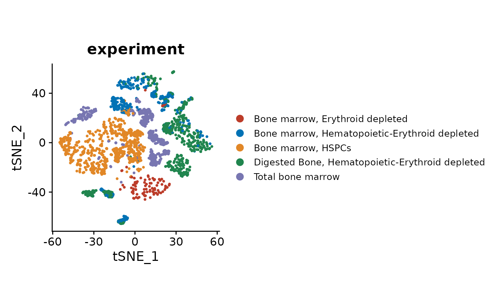
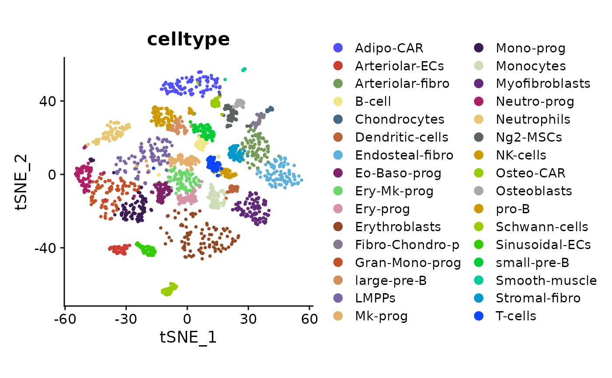

# Cell type annotation example

## Introduction

Assignment of cell type labels to scRNA-seq clusters is particularly
difficult when unexpected or poorly described populations are present.
There are fully automated algorithms for cell type annotation, but
sometimes a more in-depth analysis is helpful in understanding the
captured cells. This is an example of exploratory cell type analysis
using clustermole, starting with a Seurat object.

The dataset used in this example contains hematopoietic and stromal bone
marrow populations ([Baccin et
al.](https://doi.org/10.1038/s41556-019-0439-6)). This experiment was
selected because it includes both well-known and rare cell types.

## Load data

Load relevant packages.

``` r

library(Seurat)
library(dplyr)
library(ggplot2)
library(ggsci)
library(clustermole)
```

Download the dataset, which is stored as a Seurat object. It was subset
for this tutorial to reduce the total number of cells and speed up
processing.

``` r

so <- readRDS(url("https://osf.io/cvnqb/download"))
so
#> An object of class Seurat 
#> 16701 features across 2821 samples within 1 assay 
#> Active assay: RNA (16701 features, 2872 variable features)
#>  2 layers present: counts, data
#>  3 dimensional reductions calculated: pca, tsne, umap
```

Check the experiment labels on a tSNE visualization, as shown in the
original publication ([original
figure](https://www.nature.com/articles/s41556-019-0439-6/figures/1)).

``` r

DimPlot(so, reduction = "tsne", group.by = "experiment", shuffle = TRUE) +
  theme(aspect.ratio = 1, legend.text = element_text(size = rel(0.7))) +
  scale_color_nejm()
```



Check the cell type labels on a tSNE visualization.

``` r

DimPlot(so, reduction = "tsne", group.by = "celltype", shuffle = TRUE) +
  theme(aspect.ratio = 1, legend.text = element_text(size = rel(0.8))) +
  scale_color_igv()
```



Set the Seurat object cell identities to the predefined cell type labels
for the next steps.

``` r

Idents(so) <- "celltype"
levels(Idents(so))
#>  [1] "Adipo-CAR"        "Arteriolar-ECs"   "Arteriolar-fibro" "B-cell"          
#>  [5] "Chondrocytes"     "Dendritic-cells"  "Endosteal-fibro"  "Eo-Baso-prog"    
#>  [9] "Ery-Mk-prog"      "Ery-prog"         "Erythroblasts"    "Fibro-Chondro-p" 
#> [13] "Gran-Mono-prog"   "large-pre-B"      "LMPPs"            "Mk-prog"         
#> [17] "Mono-prog"        "Monocytes"        "Myofibroblasts"   "Neutro-prog"     
#> [21] "Neutrophils"      "Ng2-MSCs"         "NK-cells"         "Osteo-CAR"       
#> [25] "Osteoblasts"      "pro-B"            "Schwann-cells"    "Sinusoidal-ECs"  
#> [29] "small-pre-B"      "Smooth-muscle"    "Stromal-fibro"    "T-cells"
```

## Marker gene overlaps

One type of analysis facilitated by clustermole is based on the
comparison of marker genes.

### B-cells

We can start with the B-cells, which are a well-defined population used
in many studies. Find markers for the B-cell cluster.

``` r

b_markers_df <- FindMarkers(so, ident.1 = "B-cell", min.pct = 0.2, only.pos = TRUE, verbose = FALSE)
nrow(b_markers_df)
#> [1] 1631
```

We can subset to just the best 25 markers.

``` r

b_markers <- head(rownames(b_markers_df), 25)
b_markers
#>  [1] "Ms4a1"         "Fcmr"          "Cd74"          "Ly6d"         
#>  [5] "Gm43603"       "Bank1"         "2010309G21Rik" "Fcer2a"       
#>  [9] "H2-DMb2"       "H2-Eb1"        "Cd79a"         "H2-Aa"        
#> [13] "Tnfrsf13c"     "Ltb"           "Cd79b"         "Ccr7"         
#> [17] "Fcrl1"         "Spib"          "Siglecg"       "Cd83"         
#> [21] "Fcrla"         "Srpk3"         "Cd22"          "Cxcr5"        
#> [25] "H2-Ab1"
```

Check the overlap of B-cell markers with all clustermole cell type
signatures.

``` r

overlaps_tbl <- clustermole_overlaps(genes = b_markers, species = "mm")
```

Check the top scoring cell types corresponding to the B-cell cluster
markers.

``` r

head(overlaps_tbl, 15)
#> # A tibble: 15 × 9
#>    celltype_full                                                           
#>    <chr>                                                                   
#>  1 follicular_B-cells | SaVanT                                             
#>  2 B cell (Alzheimer's disease) [PMID:34103079] | Brain | MM | CellMarker  
#>  3 B Cell (Renal Cell Carcinoma) | Kidney | HS | CellMatch                 
#>  4 B cell (Renal cell carcinoma) [PMID:30093597] | Kidney | HS | CellMarker
#>  5 B cells | Immune system | MM | PanglaoDB                                
#>  6 IMGN_B_Fo_LN | SaVanT                                                   
#>  7 IMGN_B_Fo_MLN | SaVanT                                                  
#>  8 IMGN_B_T1_Sp | SaVanT                                                   
#>  9 FAN_EMBRYONIC_CTX_BRAIN_B_CELL | HS | MSigDB                            
#> 10 spleen | SaVanT                                                         
#> 11 IMGN_B_Fo_PC | SaVanT                                                   
#> 12 IMGN_B_Fo_Sp | SaVanT                                                   
#> 13 IMGN_B_FrE_BM | SaVanT                                                  
#> 14 IMGN_B_FrF_BM | SaVanT                                                  
#> 15 IMGN_B_MZ_Sp | SaVanT                                                   
#> # ℹ 8 more variables: db <chr>, species <chr>, organ <chr>, celltype <chr>,
#> #   n_genes <int>, overlap <dbl>, p_value <dbl>, fdr <dbl>
```

As would be expected for a well-defined population, the top results are
various B-cell populations. We can repeat this process for other
populations that are more obscure.

### Adipo-CAR

Find markers for the Adipo-CAR cluster. These are Cxcl12-abundant
reticular (CAR) cells expressing adipocyte-lineage genes.

``` r

acar_markers_df <- FindMarkers(so, ident.1 = "Adipo-CAR", min.pct = 0.2, only.pos = TRUE, verbose = FALSE)
acar_markers <- head(rownames(acar_markers_df), 25)
acar_markers
#>  [1] "Adipoq"        "Kng1"          "Kng2"          "Esm1"         
#>  [5] "Cxcl12"        "Lpl"           "Gdpd2"         "Agt"          
#>  [9] "Dpep1"         "Lepr"          "Fst"           "Chrdl1"       
#> [13] "Pdzrn4"        "Kitl"          "Cxcl14"        "Ccl19"        
#> [17] "Ptx3"          "Ackr4"         "1500009L16Rik" "Gas6"         
#> [21] "Serpina12"     "C4b"           "Gm4951"        "Fbln5"        
#> [25] "Wisp2"
```

Check the overlap of Adipo-CAR markers with all cell type signatures.

``` r

overlaps_tbl <- clustermole_overlaps(genes = acar_markers, species = "mm")
```

Check the top scoring cell types for the Adipo-CAR cluster.

``` r

head(overlaps_tbl, 15)
#> # A tibble: 15 × 9
#> # ℹ 9 more variables: celltype_full <chr>, db <chr>, species <chr>,
#> #   organ <chr>, celltype <chr>, n_genes <int>, overlap <dbl>, p_value <dbl>,
#> #   fdr <dbl>
```

The top results are more diverse than for B-cells, but related
populations (adipocytes and mesenchymal cells) are among the top
candidates.

### Osteoblasts

Find markers for the Osteoblasts cluster.

``` r

o_markers_df <- FindMarkers(so, ident.1 = "Osteoblasts", min.pct = 0.2, only.pos = TRUE, verbose = FALSE)
o_markers <- head(rownames(o_markers_df), 25)
o_markers
#>  [1] "Cpz"           "Smpd3"         "Col22a1"       "Ifitm5"       
#>  [5] "Mlip"          "Bglap"         "Lipc"          "Cgref1"       
#>  [9] "Col13a1"       "Entpd3"        "Fabp3"         "Bglap2"       
#> [13] "Cthrc1"        "Bglap3"        "Col11a2"       "Rerg"         
#> [17] "Cdo1"          "Car3"          "Slc36a2"       "RP23-457J22.1"
#> [21] "Col24a1"       "Col11a1"       "Bmp3"          "Cadm1"        
#> [25] "Satb2"
```

Check overlap of Osteoblasts markers with all cell type signatures.

``` r

overlaps_tbl <- clustermole_overlaps(genes = o_markers, species = "mm")
```

Check the top scoring cell types for the Osteoblasts cluster.

``` r

head(overlaps_tbl, 15)
#> # A tibble: 15 × 9
#> # ℹ 9 more variables: celltype_full <chr>, db <chr>, species <chr>,
#> #   organ <chr>, celltype <chr>, n_genes <int>, overlap <dbl>, p_value <dbl>,
#> #   fdr <dbl>
```

As would be expected, osteoblasts and bone cells are among the top
candidates.

## Enrichment of markers

Rather than comparing marker genes, it is also possible to run
enrichment of cell type signatures across all genes. This avoids having
to define an optimal set of markers.

The input is a table of expression values. Calculate the average
expression levels for each cell type.

``` r

avg_exp_mat <- AverageExpression(so)
```

Convert to a regular matrix and log-transform. By default,
[`AverageExpression()`](https://satijalab.org/seurat/reference/AverageExpression.html)
returns values on a linear scale. The averages should be log-transformed
for
[`clustermole_enrichment()`](https://igordot.github.io/clustermole/reference/clustermole_enrichment.md).

``` r

avg_exp_mat <- as.matrix(avg_exp_mat$RNA)
avg_exp_mat <- log1p(avg_exp_mat)
```

Preview the expression matrix.

``` r

avg_exp_mat[1:5, 1:5]
#>         Adipo-CAR Arteriolar-ECs Arteriolar-fibro    B-cell Chondrocytes
#> Sox17   0.0000000      2.5800606        0.0000000 0.0000000   0.00000000
#> Mrpl15  0.4315376      0.5284282        0.3304569 0.8481054   0.07307574
#> Lypla1  0.1990537      0.4477973        0.2448583 0.6352917   0.09397463
#> Gm37988 0.0000000      0.0000000        0.0000000 0.0000000   0.00000000
#> Tcea1   0.5620502      0.7077588        0.6135480 0.7798060   0.52126901
```

Run enrichment of all cell type signatures across all clusters.

``` r

enrich_tbl <- clustermole_enrichment(expr_mat = avg_exp_mat, species = "mm")
```

### B-cells

Check the most enriched cell types for the B-cell cluster.

``` r

enrich_tbl |>
  filter(cluster == "B-cell") |>
  head(15)
#> # A tibble: 15 × 9
#>    cluster
#>    <chr>  
#>  1 B-cell 
#>  2 B-cell 
#>  3 B-cell 
#>  4 B-cell 
#>  5 B-cell 
#>  6 B-cell 
#>  7 B-cell 
#>  8 B-cell 
#>  9 B-cell 
#> 10 B-cell 
#> 11 B-cell 
#> 12 B-cell 
#> 13 B-cell 
#> 14 B-cell 
#> 15 B-cell 
#> # ℹ 8 more variables: celltype_full <chr>, score <dbl>, score_rank <int>,
#> #   db <chr>, species <chr>, organ <chr>, celltype <chr>, n_genes <int>
```

As with the previous analysis, the top results are various B-cell
populations.

### Adipo-CAR

Check the most enriched cell types for the Adipo-CAR cluster.

``` r

enrich_tbl |>
  filter(cluster == "Adipo-CAR") |>
  head(15)
#> # A tibble: 15 × 9
#>    cluster  
#>    <chr>    
#>  1 Adipo-CAR
#>  2 Adipo-CAR
#>  3 Adipo-CAR
#>  4 Adipo-CAR
#>  5 Adipo-CAR
#>  6 Adipo-CAR
#>  7 Adipo-CAR
#>  8 Adipo-CAR
#>  9 Adipo-CAR
#> 10 Adipo-CAR
#> 11 Adipo-CAR
#> 12 Adipo-CAR
#> 13 Adipo-CAR
#> 14 Adipo-CAR
#> 15 Adipo-CAR
#> # ℹ 8 more variables: celltype_full <chr>, score <dbl>, score_rank <int>,
#> #   db <chr>, species <chr>, organ <chr>, celltype <chr>, n_genes <int>
```

Adipocytes are among the top hits.

### Osteoblasts

Check the most enriched cell types for the Osteoblasts cluster.

``` r

enrich_tbl |>
  filter(cluster == "Osteoblasts") |>
  head(15)
#> # A tibble: 15 × 9
#>    cluster    
#>    <chr>      
#>  1 Osteoblasts
#>  2 Osteoblasts
#>  3 Osteoblasts
#>  4 Osteoblasts
#>  5 Osteoblasts
#>  6 Osteoblasts
#>  7 Osteoblasts
#>  8 Osteoblasts
#>  9 Osteoblasts
#> 10 Osteoblasts
#> 11 Osteoblasts
#> 12 Osteoblasts
#> 13 Osteoblasts
#> 14 Osteoblasts
#> 15 Osteoblasts
#> # ℹ 8 more variables: celltype_full <chr>, score <dbl>, score_rank <int>,
#> #   db <chr>, species <chr>, organ <chr>, celltype <chr>, n_genes <int>
```

Osteoblasts are among the top hits.
